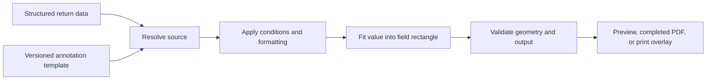
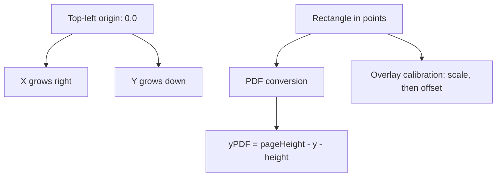
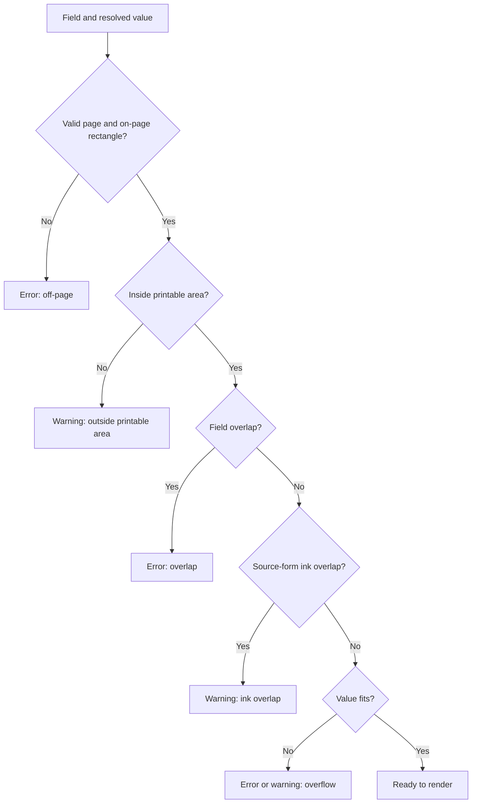

# INSTEAD Form Annotation Specification

**Version:** 1.0.0  
**Reference form:** IRS Form 1040, tax year 2025  
**Status:** Implemented reference design

## 1. Purpose

The INSTEAD annotation format is a portable contract between structured tax-return data and a fixed-layout government PDF. It records where a value belongs, how to obtain it, how to format it, when to show it, and how to validate the result before export.

The format deliberately excludes tax computation. Calculation systems produce the return data; the annotation layer places already-computed values onto a form.

## 2. Deliverables

- Canonical TypeScript interfaces: `src/lib/annotation/types.ts`
- Machine-readable JSON Schema: `docs/annotation-schema.json`
- Focused Form 1040 example: `docs/form-1040-page-1.example.json`
- Full working Form 1040 mapping: `src/data/f1040.template.json`
- Reference resolver, formatter, validator, PDF renderer, and interactive studio under `src/`

## 3. Document structure

| Property      | Purpose                                                                               |
| ------------- | ------------------------------------------------------------------------------------- |
| `specVersion` | Semantic version of the annotation contract.                                          |
| `form`        | Stable form identity, authority, year, revision, OMB number, and optional source PDF. |
| `units`       | Always `pt`; one point is 1/72 inch.                                                  |
| `origin`      | Always `top-left`; x grows right and y grows down.                                    |
| `pages`       | Zero-based page index plus native PDF width and height.                               |
| `defaults`    | Optional template-wide rendering style.                                               |
| `calibration` | Optional printer offset, scale, and printable margin.                                 |
| `fields`      | Ordered field annotations.                                                            |

## 4. Field definition

Every field requires a stable `id`, a human `label`, zero-based `page`, `rect`, `type`, and `source`. Optional properties control formatting, style, conditional visibility, comb cells, and the original AcroForm field name.

Supported field types are `text`, `currency`, `checkbox`, `comb`, `multiline`, and `date`.

### Rectangle

`rect` contains `x`, `y`, `width`, and `height`, all in PDF points. Coordinates refer to the uncalibrated source form.

### Source

- `path`: resolves one value, such as `taxpayer.ssn`.
- `template`: combines values, such as `{taxpayer.firstName} {taxpayer.middleInitial}`.
- `aggregate`: applies `sum`, `count`, `min`, `max`, or `join` to a path.
- `constant`: prints a literal value.

The path language is intentionally constrained and JSONPath-inspired. It supports nested keys, array indexes, negative indexes, wildcards, quoted keys, and simple filters. A smaller grammar is easier to validate, implement consistently, and secure than arbitrary JSONPath expressions.

### Format

Formatting is separate from sourcing so the same data can be rendered differently across forms. Available formatters cover text casing and limits, currency, masks, dates, digits, and checkbox predicates.

### Style and fitting

Styles cascade from built-in defaults to template defaults to field overrides. The renderer can shrink text to `minFontSize`, clip it, or report overflow. Comb fields divide a rectangle into fixed character cells.

## 5. Coordinate-system decision

PDF points were selected instead of percentages because tax forms are fixed physical artifacts. Points map directly to PDF geometry, preserve exact print dimensions, avoid cumulative rounding, and make the same annotation deterministic across preview and export. Percentages would be useful for fluid screens but introduce ambiguity when page boxes, crop boxes, or printer scaling differ.

A top-left origin matches browser pointer coordinates and makes visual editing intuitive. PDF export performs one explicit y-axis conversion. Geometry remains source-relative; printer calibration is applied only when generating an overlay.

## 6. Data-path decision

Paths keep annotations independent from one return model while remaining readable in JSON. The notation uses familiar dotted properties and array selectors without embedding executable code. Aggregates cover common form placement needs, while tax calculations remain outside the annotation file.

## 7. Rendering algorithm

1. Evaluate the optional condition; stop if false.
2. Resolve the source against the return data.
3. Format the value or determine checkbox state.
4. Merge styles and fit the output inside the rectangle.
5. Run data and geometry validation.
6. Apply print calibration for overlay output only.
7. Convert top-left coordinates to the target renderer and draw.

## 8. Validation

Validation reports off-page rectangles, unprintable-margin risk, overlaps between annotations, overlap with source-form content, missing data, invalid paths or formats, text overflow, and comb-length overflow. Errors indicate output likely cannot be trusted; warnings identify reviewable print or formatting risk; informational issues identify absent values.

## 9. Print calibration

Printer drift is modeled as independent x/y scale followed by x/y offset. A generated test page includes rulers, crosshairs, a printable-margin box, field outlines, and a two-inch reference line. Users print at actual size, measure the reference, adjust scale, align crosshairs, and then generate a values-only overlay for pre-printed forms.

## 10. Trade-offs

- **JSON over XML:** easier web integration, version control, and typed validation; XML remains relevant for later IRS MeF interchange.
- **Explicit rectangles over inferred layout:** more authoring work, but deterministic rendering and auditability.
- **Constrained paths over executable expressions:** less expressive, but portable and safer.
- **Separate calculation and placement:** avoids duplicating tax logic, but requires upstream data to provide computed totals.
- **Raster ink detection:** catches collisions on flat PDFs, but thresholding can produce warnings that need human review.
- **Calibration outside base geometry:** preserves canonical annotations, but each printer may need its own calibration profile.

## 11. Future enhancements

1. IRS Modernized e-File (MeF) XML mapping, including schema-version and business-rule traceability.
2. Rich conditional rules with grouped boolean expressions and cross-field assertions.
3. Repeating groups and continuation-page generation for dependents and statements.
4. Form-revision differencing and assisted coordinate migration between tax years.
5. Font embedding, multiline shaping, accessibility tagging, and locale-aware formatting.
6. Signed template releases, review workflow, provenance, and version history.
7. Automated visual regression tests comparing rendered overlays against approved references.
8. Reusable printer calibration profiles and duplex alignment support.

## 12. Compatibility and versioning

Readers must reject unsupported major versions. Additive optional properties can ship in minor versions. A form annotation must identify its authority, year, and revision so mappings are never silently reused against a changed source document.

## 13. Security and privacy

Annotation templates contain placement rules, not taxpayer records. Production systems should keep return data transient, avoid logging resolved values, encrypt stored PDFs, enforce tenant-scoped access, and retain only the minimum required output. Example data in this repository is synthetic.
